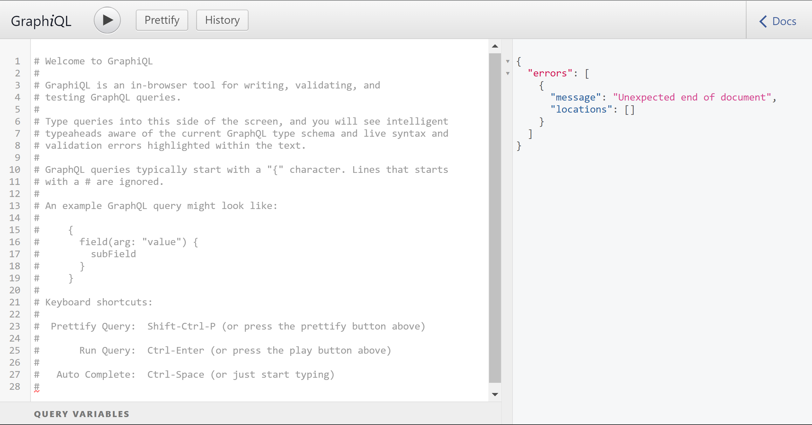
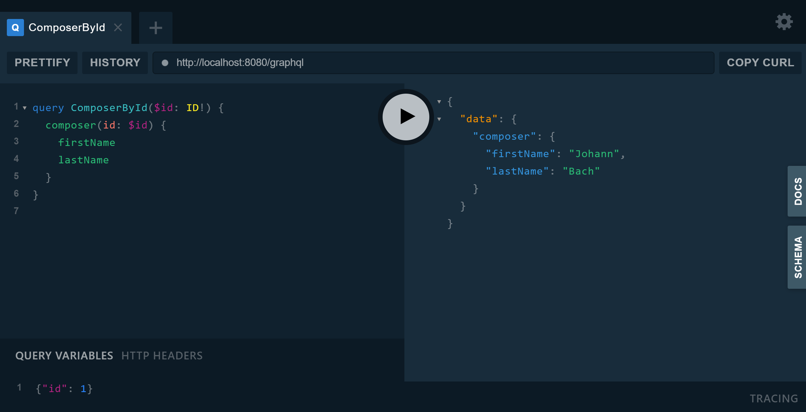
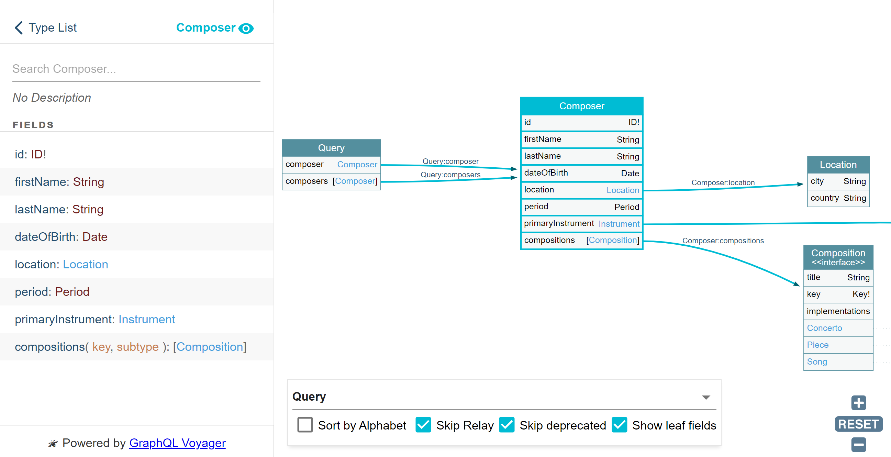

////
  Copyright 2023 The Bank of New York Mellon.

  Licensed under the Apache License, Version 2.0 (the "License");
  you may not use this file except in compliance with the License.
  You may obtain a copy of the License at

    http://www.apache.org/licenses/LICENSE-2.0

  Unless required by applicable law or agreed to in writing, software
  distributed under the License is distributed on an "AS IS" BASIS,
  WITHOUT WARRANTIES OR CONDITIONS OF ANY KIND, either express or implied.
  See the License for the specific language governing permissions and
  limitations under the License.
////

= GraphQL Tooling
1.0, March 29, 2022
:icons: font
:toc:

== GraphiQL and Playground

Many GraphQL runtimes come with a browser based client app, usually GraphiQL, Playground or both.
These environments provide documentation browsers, and request editors with hints, completions, validation, linting, and formatting.

.GraphiQL

.GraphQL Playground

== Voyager

GraphQL Voyager is a domain visualization tool. It can be used for browsing types and relationships between types in a schema.

.GraphQL Voyager

== IntelliJ GraphQL Plugin

|===
|Previous |Next

|link:./performing_operations.adoc[Performing Operations]
|link:./resources.adoc[More Resources]
|===